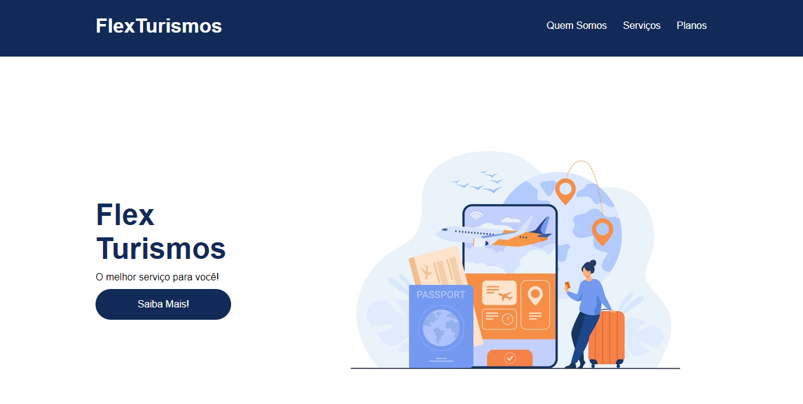
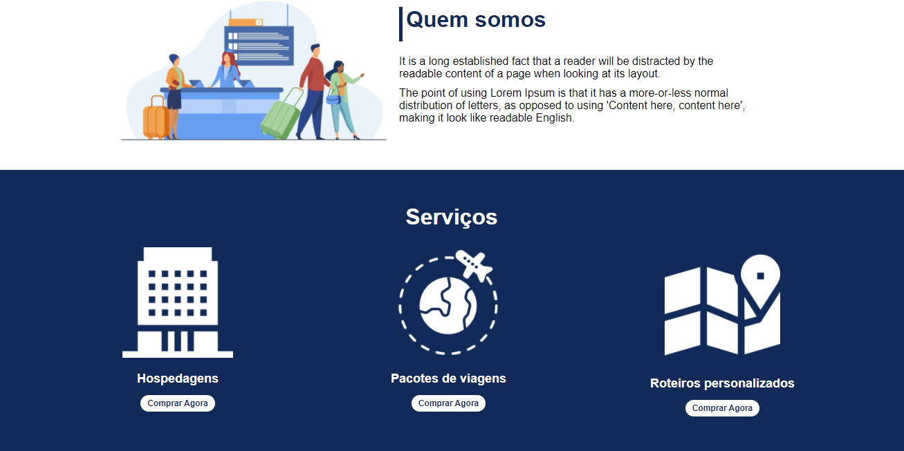
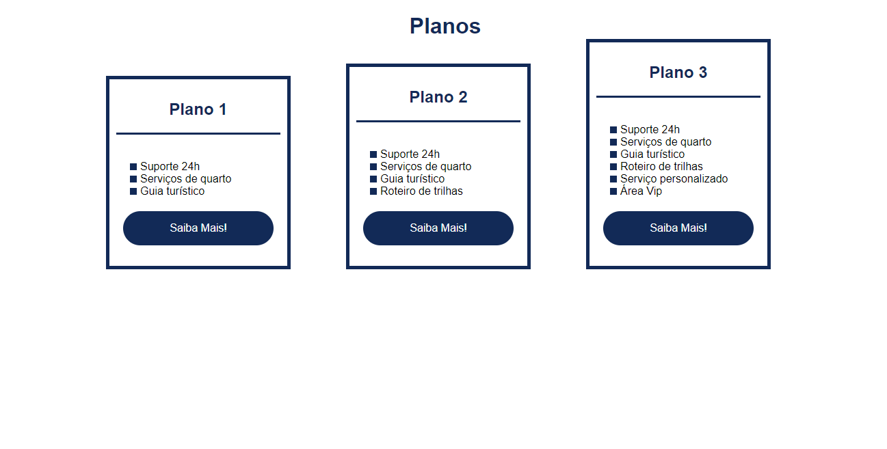

<h1 align="center">FlexTurismos</h1>
<h2 align="center">Projeto responsivo, que simula uma Landing Page de um site de turismos.</h2>

 
 

    <h3>Tecnologias utilizadas: 
    </h3>

 
 

    <h1 align="center">Site com a tela interia</h1>
    
    
    
    

##
 
 

  <h1>Click aqui para acessar o site hospedado na Vercel: <a href="https://flex-turismos-2cfyn4q9s-ricardosantanaevangelista.vercel.app">Site</a></h1>
  

  

